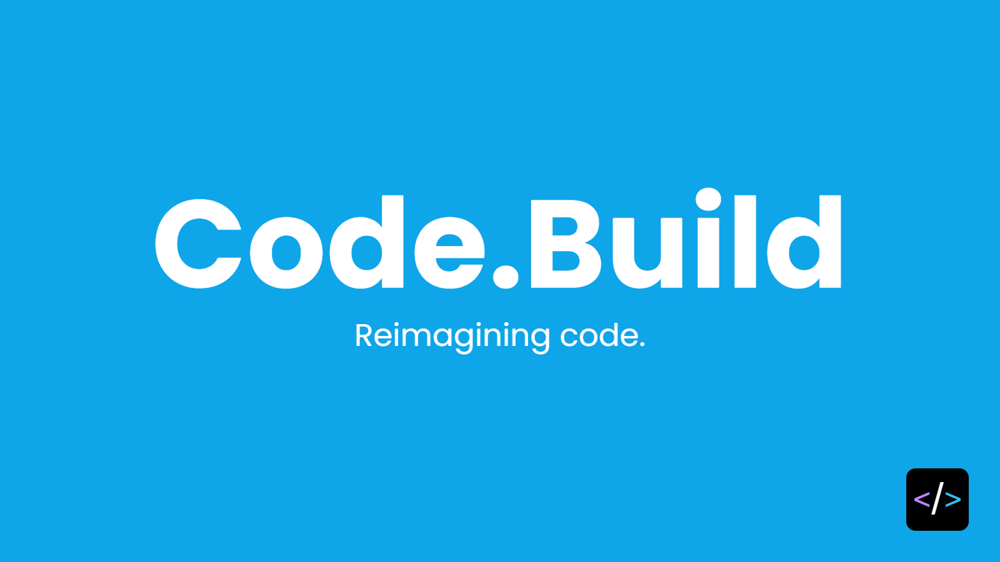

# Sponsors & Backers

PostgREST ongoing development is only possible thanks to our Sponsors and Backers, listed below. If you'd like to join them, you can do so by supporting the PostgREST organization on [Patreon](https://www.patreon.com/postgrest).

## Sponsors

<table align="center">
  <tbody>
    <tr>
      <td align="center" valign="middle">
        
      </td>
      <td align="center" valign="middle">
        
      </td>
      <td align="center" valign="middle">
        
      </td>
    </tr>
    <tr></tr>
    <tr>
      <td align="center" valign="middle">
        
      </td>
      <td align="center" valign="middle">
        
      </td>
      <td align="center" valign="middle">
        
      </td>
    </tr>
  </tbody>
</table>

## Lead Backers

- [Roboflow](https://github.com/roboflow)
- Evans Fernandes
- [Jan Sommer](https://github.com/nerfpops)
- [Franz Gusenbauer](https://www.igutech.at/)

## Backers

- Zac Miller
- Tsingson Qin
- Michel Pelletier
- Jay Hannah
- Robert Stolarz
- Nicholas DiBiase
- Christopher Reid
- Nathan Bouscal
- Daniel Rafaj
- David Fenko
- Remo Rechkemmer
- Severin Ibarluzea
- Tom Saleeba
- Pawel Tyll

## Former Backers

<table>
  <tbody>
    <tr>
      <td align="center" valign="middle">
        
      </td>
      <td align="center" valign="middle">
        
      </td>
      <td align="center" valign="middle">
        
      </td>
      <td align="center" valign="middle">
        
      </td>
    </tr>
  </tbody>
</table>

- [Christiaan Westerbeek](https://devotis.nl)
- [Daniel Babiak](https://github.com/dbabiak)
- Kofi Gumbs
