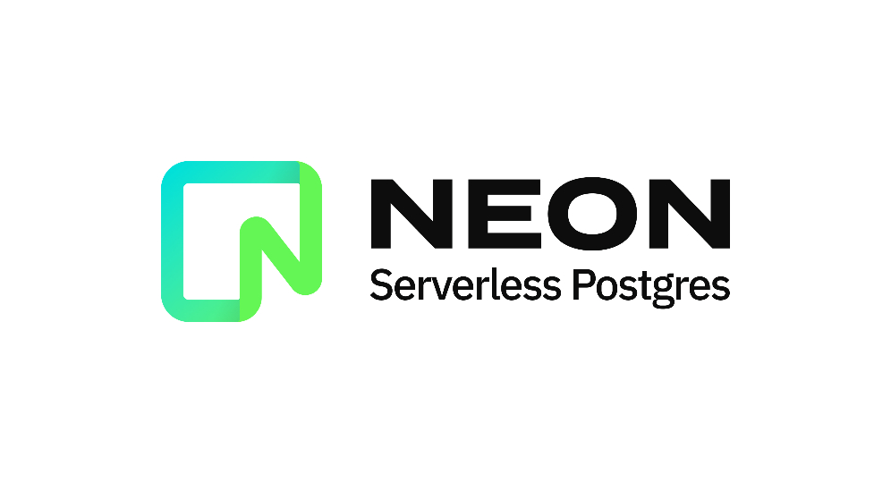
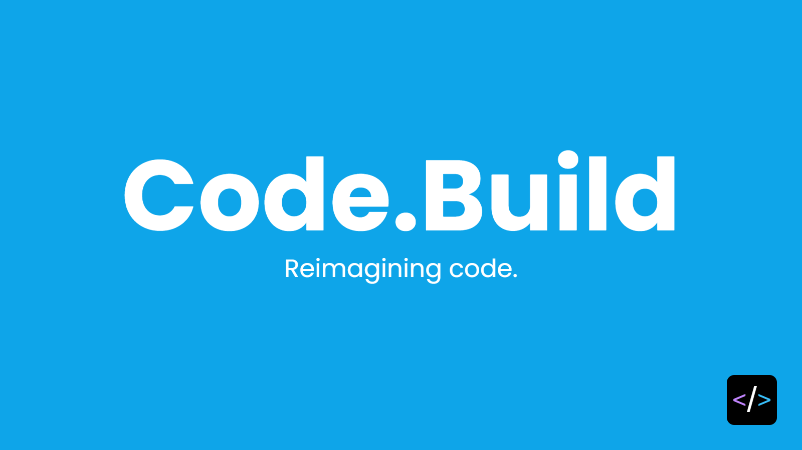

[](https://www.patreon.com/postgrest)
[](http://postgrest.org)
[](https://hub.docker.com/r/postgrest/postgrest/)
[](https://github.com/PostgREST/postgrest/actions?query=branch%3Amain)
[](https://app.codecov.io/gh/PostgREST/postgrest)
[](http://hackage.haskell.org/package/postgrest)

PostgREST serves a fully RESTful API from any existing PostgreSQL
database. It provides a cleaner, more standards-compliant, faster
API than you are likely to write from scratch.

## Sponsors

<table align="center">
  <tbody>
    <tr>
      <td align="center" valign="middle">
        <a href="https://www.cybertec-postgresql.com/en/?utm_source=postgrest.org&utm_medium=referral&utm_campaign=postgrest" target="_blank">
          
        </a>
      </td>
      <td align="center" valign="middle">
        <a href="https://gnuhost.eu/?utm_source=sponsor&utm_campaign=postgrest" target="_blank">
          
        </a>
      </td>
      <td align="center" valign="middle">
        <a href="https://neon.tech/?utm_source=sponsor&utm_campaign=postgrest" target="_blank">
          
        </a>
      </td>
    </tr>
    <tr></tr>
    <tr>
      <td align="center" valign="middle">
        <a href="https://code.build/?utm_source=sponsor&utm_campaign=postgrest" target="_blank">
          
        </a>
      </td>
      <td align="center" valign="middle">
        <a href="https://supabase.io?utm_source=postgrest%20backers&utm_medium=open%20source%20partner&utm_campaign=postgrest%20backers%20github&utm_term=homepage" target="_blank">
          
        </a>
      </td>
      <td align="center" valign="middle">
        <a href="https://tembo.io/?utm_source=sponsor&utm_campaign=postgrest" target="_blank">
          
        </a>
      </td>
    </tr>
  </tbody>
</table>

Big thanks to our sponsors! You can join them by supporting PostgREST on [Patreon](https://www.patreon.com/postgrest).

## Usage

1. Download the binary ([latest release](https://github.com/PostgREST/postgrest/releases/latest))
   for your platform.
2. Invoke for help:

    ```bash
    postgrest --help
    ```
## [Documentation](http://postgrest.org)

Latest documentation is at [postgrest.org](http://postgrest.org). You can contribute to the docs in [PostgREST/postgrest/docs](https://github.com/PostgREST/postgrest/tree/main/docs).

## Performance

TLDR; subsecond response times for up to 2000 requests/sec on Heroku
free tier. If you're used to servers written in interpreted languages,
prepare to be pleasantly surprised by PostgREST performance.

Three factors contribute to the speed. First the server is written
in [Haskell](https://www.haskell.org/) using the
[Warp](http://www.yesodweb.com/blog/2011/03/preliminary-warp-cross-language-benchmarks)
HTTP server (aka a compiled language with lightweight threads).
Next it delegates as much calculation as possible to the database
including

* Serializing JSON responses directly in SQL
* Data validation
* Authorization
* Combined row counting and retrieval
* Data post in single command (`returning *`)

Finally it uses the database efficiently with the
[Hasql](https://nikita-volkov.github.io/hasql-benchmarks/) library
by

* Keeping a pool of db connections
* Using the PostgreSQL binary protocol
* Being stateless to allow horizontal scaling

## Security

PostgREST [handles
authentication](http://postgrest.org/en/stable/auth.html) (via JSON Web
Tokens) and delegates authorization to the role information defined in
the database. This ensures there is a single declarative source of truth
for security.  When dealing with the database the server assumes the
identity of the currently authenticated user, and for the duration of
the connection cannot do anything the user themselves couldn't. Other
forms of authentication can be built on top of the JWT primitive. See
the docs for more information.

## Versioning

A robust long-lived API needs the freedom to exist in multiple
versions. PostgREST does versioning through database schemas. This
allows you to expose tables and views without making the app brittle.
Underlying tables can be superseded and hidden behind public facing
views.

## Self-documentation

PostgREST uses the [OpenAPI](https://openapis.org/) standard to
generate up-to-date documentation for APIs. You can use a tool like
[Swagger-UI](https://github.com/swagger-api/swagger-ui) to render
interactive documentation for demo requests against the live API server.

This project uses HTTP to communicate other metadata as well.  For
instance the number of rows returned by an endpoint is reported by -
and limited with - range headers. More about
[that](http://begriffs.com/posts/2014-03-06-beyond-http-header-links.html).

## Data Integrity

Rather than relying on an Object Relational Mapper and custom
imperative coding, this system requires you put declarative constraints
directly into your database. Hence no application can corrupt your
data (including your API server).

The PostgREST exposes HTTP interface with safeguards to prevent
surprises, such as enforcing idempotent PUT requests.

See examples of [PostgreSQL
constraints](http://www.tutorialspoint.com/postgresql/postgresql_constraints.htm)
and the [API guide](http://postgrest.org/en/stable/api.html).

## Supporting development

You can help PostgREST ongoing maintenance and development by making a regular donation through Patreon https://www.patreon.com/postgrest

Every donation will be spent on making PostgREST better for the whole community.

## Thanks

The PostgREST organization is grateful to:

- The project [sponsors and backers](https://github.com/PostgREST/postgrest/blob/main/BACKERS.md) who support PostgREST's development.
- The project [contributors](https://github.com/PostgREST/postgrest/graphs/contributors) who have improved PostgREST immensely with their code
  and good judgement. See more details in the [changelog](https://github.com/PostgREST/postgrest/blob/main/CHANGELOG.md).

The cool logo came from [Mikey Casalaina](https://github.com/casalaina).
