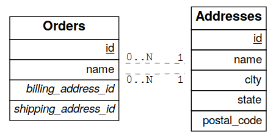

.. role:: sql(code)
   :language: sql

Tables and Views
================

All views and tables in the exposed schema and accessible by the active database role for a request are available for querying. They are exposed in one-level deep routes. For instance the full contents of a table `people` is returned at

.. code-block:: http

  GET /people HTTP/1.1

There are no deeply/nested/routes. Each route provides OPTIONS, GET, HEAD, POST, PATCH, and DELETE verbs depending entirely on database permissions.

.. note::

  Why not provide nested routes? Many APIs allow nesting to retrieve related information, such as :code:`/films/1/director`. We offer a more flexible mechanism (inspired by GraphQL) to embed related information. It can handle one-to-many and many-to-many relationships. This is covered in the section about :ref:`resource_embedding`.

.. _h_filter:

Horizontal Filtering (Rows)
---------------------------

You can filter result rows by adding conditions on columns, each condition a query string parameter. For instance, to return people aged under 13 years old:

.. code-block:: http

  GET /people?age=lt.13 HTTP/1.1

Multiple parameters can be logically conjoined by:

.. code-block:: http

  GET /people?age=gte.18&student=is.true HTTP/1.1

Multiple parameters can be logically disjoined by:

.. code-block:: http

  GET /people?or=(age.gte.14,age.lte.18) HTTP/1.1

Complex logic can also be applied:

.. code-block:: http

  GET /people?and=(grade.gte.90,student.is.true,or(age.gte.14,age.is.null)) HTTP/1.1

.. _operators:

Operators
~~~~~~~~~

These operators are available:

============  ========================  ==================================================================================
Abbreviation  In PostgreSQL             Meaning
============  ========================  ==================================================================================
eq            :code:`=`                 equals
gt            :code:`>`                 greater than
gte           :code:`>=`                greater than or equal
lt            :code:`<`                 less than
lte           :code:`<=`                less than or equal
neq           :code:`<>` or :code:`!=`  not equal
like          :code:`LIKE`              LIKE operator (use * in place of %)
ilike         :code:`ILIKE`             ILIKE operator (use * in place of %)
in            :code:`IN`                one of a list of values, e.g. :code:`?a=in.(1,2,3)`
                                        – also supports commas in quoted strings like
                                        :code:`?a=in.("hi,there","yes,you")`
is            :code:`IS`                checking for exact equality (null,true,false)
fts           :code:`@@`                :ref:`fts` using to_tsquery
plfts         :code:`@@`                :ref:`fts` using plainto_tsquery
phfts         :code:`@@`                :ref:`fts` using phraseto_tsquery
wfts          :code:`@@`                :ref:`fts` using websearch_to_tsquery
cs            :code:`@>`                contains e.g. :code:`?tags=cs.{example, new}`
cd            :code:`<@`                contained in e.g. :code:`?values=cd.{1,2,3}`
ov            :code:`&&`                overlap (have points in common), e.g. :code:`?period=ov.[2017-01-01,2017-06-30]` –
                                        also supports array types, use curly braces instead of square brackets e.g.
                                        :code: `?arr=ov.{1,3}`
sl            :code:`<<`                strictly left of, e.g. :code:`?range=sl.(1,10)`
sr            :code:`>>`                strictly right of
nxr           :code:`&<`                does not extend to the right of, e.g. :code:`?range=nxr.(1,10)`
nxl           :code:`&>`                does not extend to the left of
adj           :code:`-|-`               is adjacent to, e.g. :code:`?range=adj.(1,10)`
not           :code:`NOT`               negates another operator, see below
============  ========================  ==================================================================================

To negate any operator, prefix it with :code:`not` like :code:`?a=not.eq.2` or :code:`?not.and=(a.gte.0,a.lte.100)` .

For more complicated filters you will have to create a new view in the database, or use a stored procedure. For instance, here's a view to show "today's stories" including possibly older pinned stories:

.. code-block:: postgresql

  CREATE VIEW fresh_stories AS
  SELECT *
    FROM stories
   WHERE pinned = true
      OR published > now() - interval '1 day'
  ORDER BY pinned DESC, published DESC;

The view will provide a new endpoint:

.. code-block:: http

  GET /fresh_stories HTTP/1.1

.. _fts:

Full-Text Search
~~~~~~~~~~~~~~~~

The :code:`fts` filter mentioned above has a number of options to support flexible textual queries, namely the choice of plain vs phrase search and the language used for stemming. Suppose that :code:`tsearch` is a table with column :code:`my_tsv`, of type `tsvector <https://www.postgresql.org/docs/current/datatype-textsearch.html>`_. The following examples illustrate the possibilities.

.. code-block:: http

  GET /tsearch?my_tsv=fts(french).amusant HTTP/1.1

.. code-block:: http

  GET /tsearch?my_tsv=plfts.The%20Fat%20Cats HTTP/1.1

.. code-block:: http

  GET /tsearch?my_tsv=not.phfts(english).The%20Fat%20Cats HTTP/1.1

.. code-block:: http

  GET /tsearch?my_tsv=not.wfts(french).amusant HTTP/1.1

Using phrase search mode requires PostgreSQL of version at least 9.6 and will raise an error in earlier versions of the database.

Using `websearch_to_tsquery` requires PostgreSQL of version at least 11.0 and will raise an error in earlier versions of the database.

.. _v_filter:

Vertical Filtering (Columns)
----------------------------

When certain columns are wide (such as those holding binary data), it is more efficient for the server to withhold them in a response. The client can specify which columns are required using the :sql:`select` parameter.

.. code-block:: http

  GET /people?select=first_name,age HTTP/1.1

  [
    {"first_name": "John", "age": 30},
    {"first_name": "Jane", "age": 20}
  ]

The default is :sql:`*`, meaning all columns. This value will become more important below in :ref:`resource_embedding`.

Renaming Columns
~~~~~~~~~~~~~~~~

You can rename the columns by prefixing them with an alias followed by the colon ``:`` operator.

.. code-block:: http

  GET /people?select=fullName:full_name,birthDate:birth_date HTTP/1.1

  [
    {"fullName": "John Doe", "birthDate": "04/25/1988"},
    {"fullName": "Jane Doe", "birthDate": "01/12/1998"}
  ]

.. _casting_columns:

Casting Columns
~~~~~~~~~~~~~~~

Casting the columns is possible by suffixing them with the double colon ``::`` plus the desired type.

.. code-block:: http

  GET /people?select=full_name,salary::text HTTP/1.1

  [
    {"full_name": "John Doe", "salary": "90000.00"},
    {"full_name": "Jane Doe", "salary": "120000.00"}
  ]

.. _json_columns:

JSON Columns
~~~~~~~~~~~~

You can specify a path for a ``json`` or ``jsonb`` column using the arrow operators(``->`` or ``->>``) as per the `PostgreSQL docs <https://www.postgresql.org/docs/current/functions-json.html>`_.

.. code-block:: http

  GET /people?select=id,json_data->>blood_type,json_data->phones HTTP/1.1

  [
    { "id": 1, "blood_type": "A-", "phones": [{"country_code": "61", "number": "917-929-5745"}] },
    { "id": 2, "blood_type": "O+", "phones": [{"country_code": "43", "number": "512-446-4988"}, {"country_code": "43", "number": "213-891-5979"}] }
  ]

.. code-block:: http

  GET /people?select=id,json_data->phones->0->>number HTTP/1.1

  [
    { "id": 1, "number": "917-929-5745"},
    { "id": 2, "number": "512-446-4988"}
  ]

This also works with filters:

.. code-block:: http

  GET /people?select=id,json_data->blood_type&json_data->>blood_type=eq.A- HTTP/1.1

  [
    { "id": 1, "blood_type": "A-" },
    { "id": 3, "blood_type": "A-" },
    { "id": 7, "blood_type": "A-" }
  ]

Note that ``->>`` is used to compare ``blood_type`` as ``text``. To compare with an integer value use ``->``:

.. code-block:: http

  GET /people?select=id,json_data->age&json_data->age=gt.20 HTTP/1.1

  [
    { "id": 11, "age": 25 },
    { "id": 12, "age": 30 },
    { "id": 15, "age": 35 }
  ]

.. _computed_cols:

Computed Columns
~~~~~~~~~~~~~~~~

Filters may be applied to computed columns(**a.k.a. virtual columns**) as well as actual table/view columns, even though the computed columns will not appear in the output. For example, to search first and last names at once we can create a computed column that will not appear in the output but can be used in a filter:

.. code-block:: postgres

  CREATE TABLE people (
    fname text,
    lname text
  );

  CREATE FUNCTION full_name(people) RETURNS text AS $$
    SELECT $1.fname || ' ' || $1.lname;
  $$ LANGUAGE SQL;

  -- (optional) add an index to speed up anticipated query
  CREATE INDEX people_full_name_idx ON people
    USING GIN (to_tsvector('english', full_name(people)));

A full-text search on the computed column:

.. code-block:: http

  GET /people?full_name=fts.Beckett HTTP/1.1

As mentioned, computed columns do not appear in the output by default. However you can include them by listing them in the vertical filtering :code:`select` parameter:

.. code-block:: HTTP

  GET /people?select=*,full_name HTTP/1.1

.. important::

  Computed columns must be created under the :ref:`exposed schema <db-schema>` to be used in this way.

Unicode support
---------------

PostgREST supports unicode in schemas, tables, columns and values. To access a table with unicode name, use percent encoding.

To request this:

.. code-block:: http

  GET /موارد HTTP/1.1

Do this:

.. code-block:: http

  GET /%D9%85%D9%88%D8%A7%D8%B1%D8%AF HTTP/1.1

.. _tabs-cols-w-spaces:

Table / Columns with spaces
~~~~~~~~~~~~~~~~~~~~~~~~~~~

You can request table/columns with spaces in them by percent encoding the spaces with ``%20``:

.. code-block:: http

  GET /Order%20Items?Unit%20Price=lt.200 HTTP/1.1

.. _reserved-chars:

Reserved characters
~~~~~~~~~~~~~~~~~~~

If filters include PostgREST reserved characters(``,``, ``.``, ``:``, ``()``) you'll have to surround them in percent encoded double quotes ``%22`` for correct processing.

Here ``Hebdon,John`` and ``Williams,Mary`` are values.

.. code-block:: http

  GET /employees?name=in.(%22Hebdon,John%22,%22Williams,Mary%22) HTTP/1.1

Here ``information.cpe`` is a column name.

.. code-block:: http

  GET /vulnerabilities?%22information.cpe%22=like.*MS* HTTP/1.1

.. note::

   Some HTTP libraries might encode URLs automatically(e.g. :code:`axios`). In these cases you should use double quotes
   :code:`""` directly instead of :code:`%22`.

Ordering
--------

The reserved word :sql:`order` reorders the response rows. It uses a comma-separated list of columns and directions:

.. code-block:: http

  GET /people?order=age.desc,height.asc HTTP/1.1

If no direction is specified it defaults to ascending order:

.. code-block:: http

  GET /people?order=age HTTP/1.1

If you care where nulls are sorted, add ``nullsfirst`` or ``nullslast``:

.. code-block:: http

  GET /people?order=age.nullsfirst HTTP/1.1

.. code-block:: http

  GET /people?order=age.desc.nullslast HTTP/1.1

You can also use :ref:`computed_cols` to order the results, even though the computed columns will not appear in the output.

.. _limits:

Limits and Pagination
---------------------

PostgREST uses HTTP range headers to describe the size of results. Every response contains the current range and, if requested, the total number of results:

.. code-block:: http

  HTTP/1.1 200 OK
  Range-Unit: items
  Content-Range: 0-14/*

Here items zero through fourteen are returned. This information is available in every response and can help you render pagination controls on the client. This is an RFC7233-compliant solution that keeps the response JSON cleaner.

There are two ways to apply a limit and offset rows: through request headers or query parameters. When using headers you specify the range of rows desired. This request gets the first twenty people.

.. code-block:: http

  GET /people HTTP/1.1
  Range-Unit: items
  Range: 0-19

Note that the server may respond with fewer if unable to meet your request:

.. code-block:: http

  HTTP/1.1 200 OK
  Range-Unit: items
  Content-Range: 0-17/*

You may also request open-ended ranges for an offset with no limit, e.g. :code:`Range: 10-`.

The other way to request a limit or offset is with query parameters. For example

.. code-block:: http

  GET /people?limit=15&offset=30 HTTP/1.1

This method is also useful for embedded resources, which we will cover in another section. The server always responds with range headers even if you use query parameters to limit the query.

.. _exact_count:

Exact Count
-----------

In order to obtain the total size of the table or view (such as when rendering the last page link in a pagination control), specify ``Prefer: count=exact`` as a request header:

.. code-block:: http

  HEAD /bigtable HTTP/1.1
  Range-Unit: items
  Range: 0-24
  Prefer: count=exact

Note that the larger the table the slower this query runs in the database. The server will respond with the selected range and total

.. code-block:: http

  HTTP/1.1 206 Partial Content
  Range-Unit: items
  Content-Range: 0-24/3573458

.. _planned_count:

Planned Count
-------------

To avoid the shortcomings of :ref:`exact count <exact_count>`, PostgREST can leverage PostgreSQL statistics and get a fairly accurate and fast count.
To do this, specify the ``Prefer: count=planned`` header.

.. code-block:: http

  HEAD /bigtable?limit=25 HTTP/1.1
  Prefer: count=planned

.. code-block:: http

  HTTP/1.1 206 Partial Content
  Content-Range: 0-24/3572000

Note that the accuracy of this count depends on how up-to-date are the PostgreSQL statistics tables.
For example in this case, to increase the accuracy of the count you can do ``ANALYZE bigtable``.
See `ANALYZE <https://www.postgresql.org/docs/current/sql-analyze.html>`_ for more details.

.. _estimated_count:

Estimated Count
---------------

When you are interested in the count, the relative error is important. If you have a :ref:`planned count <planned_count>` of 1000000 and the exact count is
1001000, the error is small enough to be ignored. But with a planned count of 7, an exact count of 28 would be a huge misprediction.

In general, when having smaller row-counts, the estimated count should be as close to the exact count as possible.

To help with these cases, PostgREST can get the exact count up until a threshold and get the planned count when
that threshold is surpassed. To use this behavior, you can specify the ``Prefer: count=estimated`` header. The **threshold** is
defined by :ref:`max-rows`.

Here's an example. Suppose we set ``max-rows=1000`` and ``smalltable`` has 321 rows, then we'll get the exact count:

.. code-block:: http

  HEAD /smalltable?limit=25 HTTP/1.1
  Prefer: count=estimated

.. code-block:: http

  HTTP/1.1 206 Partial Content
  Content-Range: 0-24/321

If we make a similar request on ``bigtable``, which has 3573458 rows, we would get the planned count:

.. code-block:: http

  HEAD /bigtable?limit=25 HTTP/1.1
  Prefer: count=estimated

.. code-block:: http

  HTTP/1.1 206 Partial Content
  Content-Range: 0-24/3572000

.. _res_format:

Response Format
---------------

PostgREST uses proper HTTP content negotiation (`RFC7231 <https://datatracker.ietf.org/doc/html/rfc7231#section-5.3>`_) to deliver the desired representation of a resource. That is to say the same API endpoint can respond in different formats like JSON or CSV depending on the client request.

Use the Accept request header to specify the acceptable format (or formats) for the response:

.. code-block:: http

  GET /people HTTP/1.1
  Accept: application/json

The current possibilities are:

* ``*/*``
* ``text/csv``
* ``application/json``
* ``application/openapi+json``
* ``application/octet-stream``

The server will default to JSON for API endpoints and OpenAPI on the root.

.. _singular_plural:

Singular or Plural
------------------

By default PostgREST returns all JSON results in an array, even when there is only one item. For example, requesting :code:`/items?id=eq.1` returns

.. code:: json

  [
    { "id": 1 }
  ]

This can be inconvenient for client code. To return the first result as an object unenclosed by an array, specify :code:`vnd.pgrst.object` as part of the :code:`Accept` header

.. code-block:: http

  GET /items?id=eq.1 HTTP/1.1
  Accept: application/vnd.pgrst.object+json

This returns

.. code:: json

  { "id": 1 }

When a singular response is requested but no entries are found, the server responds with an error message and 406 Not Acceptable status code rather than the usual empty array and 200 status:

.. code-block:: json

  {
    "message": "JSON object requested, multiple (or no) rows returned",
    "details": "Results contain 0 rows, application/vnd.pgrst.object+json requires 1 row"
  }

.. note::

  Many APIs distinguish plural and singular resources using a special nested URL convention e.g. `/stories` vs `/stories/1`. Why do we use `/stories?id=eq.1`? The answer is because a singular resource is (for us) a row determined by a primary key, and primary keys can be compound (meaning defined across more than one column). The more familiar nested urls consider only a degenerate case of simple and overwhelmingly numeric primary keys. These so-called artificial keys are often introduced automatically by Object Relational Mapping libraries.

  Admittedly PostgREST could detect when there is an equality condition holding on all columns constituting the primary key and automatically convert to singular. However this could lead to a surprising change of format that breaks unwary client code just by filtering on an extra column. Instead we allow manually specifying singular vs plural to decouple that choice from the URL format.

.. _resource_embedding:

Resource Embedding
==================

In addition to providing RESTful routes for each table and view, PostgREST allows related resources to be included together in a single
API call. This reduces the need for multiple API requests. The server uses **foreign keys** to determine which tables and views can be
returned together. For example, consider a database of films and their awards:

.. important::

  PostgREST needs `FOREIGN KEY constraints <https://www.postgresql.org/docs/current/tutorial-fk.html>`_ to be able to do Resource Embedding.

.. image:: _static/film.png

As seen above in :ref:`v_filter` we can request the titles of all films like this:

.. code-block:: http

  GET /films?select=title HTTP/1.1

This might return something like

.. code-block:: json

  [
    { "title": "Workers Leaving The Lumière Factory In Lyon" },
    { "title": "The Dickson Experimental Sound Film" },
    { "title": "The Haunted Castle" }
  ]

However because a foreign key constraint exists between Films and Directors, we can request this information be included:

.. code-block:: http

  GET /films?select=title,directors(id,last_name) HTTP/1.1

Which would return

.. code-block:: json

  [
    { "title": "Workers Leaving The Lumière Factory In Lyon",
      "directors": {
        "id": 2,
        "last_name": "Lumière"
      }
    },
    { "title": "The Dickson Experimental Sound Film",
      "directors": {
        "id": 1,
        "last_name": "Dickson"
      }
    },
    { "title": "The Haunted Castle",
      "directors": {
        "id": 3,
        "last_name": "Méliès"
      }
    }
  ]

In this example, since the relationship is a forward relationship, there is
only one director associated with a film. As the table name is plural it might
be preferable for it to be singular instead. An table name alias can accomplish
this:

.. code-block:: http

  GET /films?select=title,director:directors(id,last_name) HTTP/1.1

.. important::

  Whenever FOREIGN KEY constraints change in the database schema you must refresh PostgREST's schema cache for Resource Embedding to work properly. See the section :ref:`schema_reloading`.

Embedding through join tables
-----------------------------

PostgREST can also detect relationships going through join tables. Thus you can request the Actors for Films (which in this case finds the information through Roles).

.. code-block:: http

  GET /actors?select=films(title,year) HTTP/1.1

Embedded Filters
----------------

Embedded resources can be shaped similarly to their top-level counterparts. To do so, prefix the query parameters with the name of the embedded resource. For instance, to order the actors in each film:

.. code-block:: http

  GET /films?select=*,actors(*)&actors.order=last_name,first_name HTTP/1.1

This sorts the list of actors in each film but does *not* change the order of the films themselves. To filter the roles returned with each film:

.. code-block:: http

  GET /films?select=*,roles(*)&roles.character=in.(Chico,Harpo,Groucho) HTTP/1.1

Once again, this restricts the roles included to certain characters but does not filter the films in any way. Films without any of those characters would be included along with empty character lists.

An ``or`` filter  can be used for a similar operation:

.. code-block:: http

  GET /films?select=*,roles(*)&roles.or=(character.eq.Gummo,character.eq.Zeppo) HTTP/1.1

Limit and offset operations are possible:

.. code-block:: http

  GET /films?select=*,actors(*)&actors.limit=10&actors.offset=2 HTTP/1.1

Embedded resources can be aliased and filters can be applied on these aliases:

.. code-block:: http

  GET /films?select=*,90_comps:competitions(name),91_comps:competitions(name)&90_comps.year=eq.1990&91_comps.year=eq.1991 HTTP/1.1

.. _embedding_views:

Embedding Views
---------------

Embedding a view is possible if the view contains columns that have **foreign keys** defined in their source tables.

As an example, let's create a view called ``nominations_view`` based on the *nominations* table.

.. code-block:: postgres

  CREATE VIEW nominations_view AS
  SELECT
     rank
   , competition_id
   , film_id
  FROM
    nominations;

Since it contains ``competition_id`` and ``film_id`` — and each one has a **foreign key** defined in its source table — we can embed *competitions* and *films*:

.. code-block:: http

  GET /nominations_view?select=rank,competitions(name,year),films(title)&rank=eq.5 HTTP/1.1

It's also possible to embed `Materialized Views <https://www.postgresql.org/docs/current/rules-materializedviews.html>`_.

.. warning::

   It's not guaranteed that all kinds of views will be embeddable. In particular, views that contain
   UNIONs will not be made embeddable.

   Why? PostgREST detects source table foreign keys in the view by querying and parsing `pg_rewrite <https://www.postgresql.org/docs/current/catalog-pg-rewrite.html>`_.
   This may fail depending on the complexity of the view.

   `Report an issue <https://github.com/PostgREST/postgrest/issues>`_ if your view is not made embeddable so we can
   keep continue improving foreign key detection.

   In the future we'll include a way to manually specify views source foreign keys to address this limitation.

.. important::

  If view definitions change you must refresh PostgREST's schema cache for this to work properly. See the section :ref:`schema_reloading`.

.. _s_proc_embed:

.. _embedding_view_chains:

Embedding Chains of Views
-------------------------

Views can also depend on other views, which in turn depend on the actual source table. For PostgREST to pick up those chains recursively to any depth, all the views must be in the search path, so either in the exposed schema (:ref:`db-schema`) or in one of the schemas set in :ref:`db-extra-search-path`. This does not apply to the source table, which could be in a private schema as well. See :ref:`schema_isolation` for more details.

Embedding on Stored Procedures
------------------------------

If you have a :ref:`Stored Procedure <s_procs>` that returns a table type, you can embed its related resources.

Here's a sample function (notice the ``RETURNS SETOF films``).

.. code-block:: plpgsql

  CREATE FUNCTION getallfilms() RETURNS SETOF films AS $$
    SELECT * FROM films;
  $$ LANGUAGE SQL IMMUTABLE;

A request with ``directors`` embedded:

.. code-block:: http

   GET /rpc/getallfilms?select=title,directors(id,last_name)&title=like.*Workers* HTTP/1.1

.. code-block:: json

   [
     { "title": "Workers Leaving The Lumière Factory In Lyon",
       "directors": {
         "id": 2,
         "last_name": "Lumière"
       }
     }
   ]

.. _mutation_embed:

Embedding after Insertions/Updates/Deletions
--------------------------------------------

You can embed related resources after doing :ref:`insert_update` or :ref:`delete`.

Say you want to insert a **film** and then get some of its attributes plus embed its **director**.

.. code-block:: http

   POST /films?select=title,year,director:directors(first_name,last_name) HTTP/1.1
   Prefer: return=representation

   {
    "id": 100,
    "director_id": 40,
    "title": "127 hours",
    "year": 2010,
    "rating": 7.6,
    "language": "english"
   }

Response:

.. code-block:: json

   {
    "title": "127 hours",
    "year": 2010,
    "director": {
      "first_name": "Danny",
      "last_name": "Boyle"
    }
   }

.. _embed_disamb:

Embedding Disambiguation
------------------------

For doing resource embedding, PostgREST infers the relationship between two tables based on a foreign key between them.
However, in cases where there's more than one foreign key between two tables, it's not possible to infer the relationship unambiguously
by just specifying the tables names.

Target Disambiguation
~~~~~~~~~~~~~~~~~~~~~

For example, suppose you have the following ``orders`` and ``addresses`` tables:

And you try to embed ``orders`` with ``addresses`` (this is the **target**):

.. code-block:: http

  GET /orders?select=*,addresses(*) HTTP/1.1

Since the ``orders`` table has two foreign keys to the ``addresses`` table — an order has a billing address and a shipping address —
the request is ambiguous and PostgREST will respond with an error:

.. code-block:: http

   HTTP/1.1 300 Multiple Choices

If this happens, you need to disambiguate the request by adding precision to the **target**.
Instead of the **table name**, you can specify the **foreign key constraint name** or the **column name** that is part of the foreign key.

Let's try first with the **foreign key constraint name**. To make it clearer we can name it:

.. code-block:: postgresql

   ALTER TABLE orders
      ADD CONSTRAINT billing_address  foreign key (billing_address_id) references addresses(id),
      ADD CONSTRAINT shipping_address foreign key (shipping_address_id) references addresses(id);

   -- Or if the constraints names were already generated by PostgreSQL we can rename them
   -- ALTER TABLE orders
   --   RENAME CONSTRAINT orders_billing_address_id_fkey  TO billing_address,
   --   RENAME CONSTRAINT orders_shipping_address_id_fkey TO shipping_address;

Now we can unambiguously embed the billing address by specifying the ``billing_address`` foreign key constraint as the **target**.

.. code-block:: http

  GET /orders?select=name,billing_address(name) HTTP/1.1

   [
    {
     "name": "Personal Water Filter",
     "billing_address": {
       "name": "32 Glenlake Dr.Dearborn, MI 48124"
     }
    }
   ]

Alternatively, you can specify the **column name** of the foreign key constraint as the **target**. This can be aliased to make
the result more clear.

.. code-block:: http

  GET /orders?select=name,billing_address:billing_address_id(name) HTTP/1.1

   [
    {
     "name": "Personal Water Filter",
     "billing_address": {
      "name": "32 Glenlake Dr.Dearborn, MI 48124"
     }
    }
   ]

Hint Disambiguation
~~~~~~~~~~~~~~~~~~~

If specifying the **target** is not enough for unambiguous embedding, you can add a **hint**. For example, let's assume we create
two views of ``addresses``: ``central_addresses`` and ``eastern_addresses``.

Since PostgREST supports :ref:`embedding_views` by detecting **source foreign keys** in the views, embedding with the foreign key
as the **target** will not be enough for an unambiguous embed:

.. code-block:: http

  GET /orders?select=*,billing_address(*) HTTP/1.1

  HTTP/1.1 300 Multiple Choices

For solving this case, in addition to the **target**, we can add a **hint**.
Here we specify ``central_addresses`` as the **target** and the ``billing_address`` foreign key as the **hint**:

.. code-block:: http

  GET /orders?select=*,central_addresses!billing_address(*) HTTP/1.1

  HTTP/1.1 200 OK

  [ ... ]

Similarly to the **target**, the **hint** can be a **table name**, **foreign key constraint name** or **column name**.

.. _insert_update:

Insertions / Updates
====================

All tables and `auto-updatable views <https://www.postgresql.org/docs/current/sql-createview.html#SQL-CREATEVIEW-UPDATABLE-VIEWS>`_ can be modified through the API, subject to permissions of the requester's database role.

To create a row in a database table post a JSON object whose keys are the names of the columns you would like to create. Missing properties will be set to default values when applicable.

.. code-block:: HTTP

  POST /table_name HTTP/1.1

  { "col1": "value1", "col2": "value2" }

If the table has a primary key, the response will include a :code:`Location` header describing where to find the new object. If the table is write-only then constructing the Location header will cause a permissions error. To successfully insert an item to a write-only table you will need to suppress the Location response header by including the request header :code:`Prefer: return=minimal`.

On the other end of the spectrum you can get the full created object back in the response to your request by including the header :code:`Prefer: return=representation`. That way you won't have to make another HTTP call to discover properties that may have been filled in on the server side. You can also apply the standard :ref:`v_filter` to these results.

URL encoded payloads can be posted with ``Content-Type: application/x-www-form-urlencoded``.

.. code-block:: http

  POST /people HTTP/1.1
  Content-Type: application/x-www-form-urlencoded

  name=John+Doe&age=50&weight=80

.. note::

  When inserting a row you must post a JSON object, not quoted JSON.

  .. code::

    Yes
    { "a": 1, "b": 2 }

    No
    "{ \"a\": 1, \"b\": 2 }"

  Some JavaScript libraries will post the data incorrectly if you're not careful. For best results try one of the :ref:`clientside_libraries` built for PostgREST.

To update a row or rows in a table, use the PATCH verb. Use :ref:`h_filter` to specify which record(s) to update. Here is an example query setting the :code:`category` column to child for all people below a certain age.

.. code-block:: http

  PATCH /people?age=lt.13 HTTP/1.1

  { "category": "child" }

Updates also support :code:`Prefer: return=representation` plus :ref:`v_filter`.

.. warning::

  Beware of accidentally updating every row in a table. To learn to prevent that see :ref:`block_fulltable`.

.. _bulk_insert:

Bulk Insert
-----------

Bulk insert works exactly like single row insert except that you provide either a JSON array of objects having uniform keys, or lines in CSV format. This not only minimizes the HTTP requests required but uses a single INSERT statement on the back-end for efficiency. Note that using CSV requires less parsing on the server and is much faster.

To bulk insert CSV simply post to a table route with :code:`Content-Type: text/csv` and include the names of the columns as the first row. For instance

.. code-block:: http

  POST /people HTTP/1.1
  Content-Type: text/csv

  name,age,height
  J Doe,62,70
  Jonas,10,55

An empty field (:code:`,,`) is coerced to an empty string and the reserved word :code:`NULL` is mapped to the SQL null value. Note that there should be no spaces between the column names and commas.

To bulk insert JSON post an array of objects having all-matching keys

.. code-block:: http

  POST /people HTTP/1.1
  Content-Type: application/json

  [
    { "name": "J Doe", "age": 62, "height": 70 },
    { "name": "Janus", "age": 10, "height": 55 }
  ]

.. _specify_columns:

Specifying Columns
------------------

By using the :code:`columns` query parameter it's possible to specify the payload keys that will be inserted/updated
and ignore the rest of the payload.

.. code-block:: http

   POST /datasets?columns=source,publication_date,figure HTTP/1.1
   Content-Type: application/json

   {
     "source": "Natural Disaster Prevention and Control",
     "publication_date": "2015-09-11",
     "figure": 1100,
     "location": "...",
     "comment": "...",
     "extra": "...",
     "stuff": "..."
   }

In this case, only **source**, **publication_date** and **figure** will be inserted. The rest of the JSON keys will be ignored.

Using this also has the side-effect of being more efficient for :ref:`bulk_insert` since PostgREST will not process the JSON and
it'll send it directly to PostgreSQL.

.. _upsert:

UPSERT
------

You can make an UPSERT with :code:`POST` and the :code:`Prefer: resolution=merge-duplicates` header:

.. code-block:: http

  POST /employees HTTP/1.1
  Prefer: resolution=merge-duplicates

  [
    { "id": 1, "name": "Old employee 1", "salary": 30000 },
    { "id": 2, "name": "Old employee 2", "salary": 42000 },
    { "id": 3, "name": "New employee 3", "salary": 50000 }
  ]

By default, UPSERT operates based on the primary key columns, you must specify all of them. You can also choose to ignore the duplicates with :code:`Prefer: resolution=ignore-duplicates`. This works best when the primary key is natural, but it's also possible to use it if the primary key is surrogate (example: "id serial primary key"). For more details read `this issue <https://github.com/PostgREST/postgrest/issues/1118>`_.

.. important::
  After creating a table or changing its primary key, you must refresh PostgREST schema cache for UPSERT to work properly. To learn how to refresh the cache see :ref:`schema_reloading`.

.. _on_conflict:

On Conflict
~~~~~~~~~~~

By specifying the ``on_conflict`` query parameter, you can make UPSERT work on a column(s) that has a UNIQUE constraint.

.. code-block:: http

  POST /employees?on_conflict=name HTTP/1.1
  Prefer: resolution=merge-duplicates

  [
    { "name": "Old employee 1", "salary": 40000 },
    { "name": "Old employee 2", "salary": 52000 },
    { "name": "New employee 3", "salary": 60000 }
  ]

PUT
~~~

A single row UPSERT can be done by using :code:`PUT` and filtering the primary key columns with :code:`eq`:

.. code-block:: http

  PUT /employees?id=eq.4 HTTP/1.1

  { "id": 4, "name": "Sara B.", "salary": 60000 }

All the columns must be specified in the request body, including the primary key columns.

.. note::

  Upsert features are only available starting from PostgreSQL 9.5 since it uses the `ON CONFLICT clause <https://www.postgresql.org/docs/current/sql-insert.html#SQL-ON-CONFLICT>`_.

.. _delete:

Deletions
=========

To delete rows in a table, use the DELETE verb plus :ref:`h_filter`. For instance deleting inactive users:

.. code-block:: http

  DELETE /user?active=is.false HTTP/1.1

Deletions also support :code:`Prefer: return=representation` plus :ref:`v_filter`.

.. code-block:: HTTP

  DELETE /user?id=eq.1 HTTP/1.1
  Prefer: return=representation

  {"id": 1, "email": "johndoe@email.com"}

.. warning::

  Beware of accidentally deleting all rows in a table. To learn to prevent that see :ref:`block_fulltable`.

.. _custom_queries:

Custom Queries
==============

The PostgREST URL grammar limits the kinds of queries clients can perform. It prevents arbitrary, potentially poorly constructed and slow client queries. It's good for quality of service, but means database administrators must create custom views and stored procedures to provide richer endpoints. The most common causes for custom endpoints are

* Table unions
* More complicated joins than those provided by `Resource Embedding`_
* Geo-spatial queries that require an argument, like "points near (lat,lon)"

.. _s_procs:

Stored Procedures
=================

Every stored procedure in the API-exposed database schema is accessible under the :code:`/rpc` prefix. The API endpoint supports POST (and in some cases GET) to execute the function.

.. code-block:: http

  POST /rpc/function_name HTTP/1.1

Such functions can perform any operations allowed by PostgreSQL (read data, modify data, and even DDL operations).

To supply arguments in an API call, include a JSON object in the request payload and each key/value of the object will become an argument.

For instance, assume we have created this function in the database.

.. code-block:: plpgsql

  CREATE FUNCTION add_them(a integer, b integer)
  RETURNS integer AS $$
   SELECT a + b;
  $$ LANGUAGE SQL IMMUTABLE;

.. important::

  Whenever you create or change a function you must refresh PostgREST's schema cache. See the section :ref:`schema_reloading`.

The client can call it by posting an object like

.. code-block:: http

  POST /rpc/add_them HTTP/1.1

  { "a": 1, "b": 2 }

  3

Procedures must be declared with named parameters. Procedures declared like

.. code-block:: plpgsql

  CREATE FUNCTION non_named_args(integer, text, integer) ...

cannot be called with PostgREST, since we use `named notation <https://www.postgresql.org/docs/current/sql-syntax-calling-funcs.html#SQL-SYNTAX-CALLING-FUNCS-NAMED>`_ internally.

Note that PostgreSQL converts identifier names to lowercase unless you quote them like:

.. code-block:: postgres

  CREATE FUNCTION "someFunc"("someParam" text) ...

PostgreSQL has four procedural languages that are part of the core distribution: PL/pgSQL, PL/Tcl, PL/Perl, and PL/Python. There are many other procedural languages distributed as additional extensions. Also, plain SQL can be used to write functions (as shown in the example above).

.. note::

  Why the ``/rpc`` prefix? One reason is to avoid name collisions between views and procedures. It also helps emphasize to API consumers that these functions are not normal restful things. The functions can have arbitrary and surprising behavior, not the standard "post creates a resource" thing that users expect from the other routes.

Immutable and stable functions
------------------------------

PostgREST executes POST requests in a read/write transaction except for functions marked as ``IMMUTABLE`` or ``STABLE``. Those must not modify the database and are executed in a read-only transaction compatible for read-replicas.

Procedures that do not modify the database can be called with the HTTP GET verb as well, if desired. PostgREST executes all GET requests in a read-only transaction. Modifying the database inside read-only transactions is not possible and calling volatile functions with GET will fail.

.. note::

  The `volatility marker <https://www.postgresql.org/docs/current/xfunc-volatility.html>`_ is a promise about the behavior of the function.  PostgreSQL will let you mark a function that modifies the database as ``IMMUTABLE`` or ``STABLE`` without failure.  However, because of the read-only transaction this would still fail with PostgREST.

Because ``add_them`` is ``IMMUTABLE``, we can alternately call the function with a GET request:

.. code-block:: http

  GET /rpc/add_them?a=1&b=2 HTTP/1.1

The function parameter names match the JSON object keys in the POST case, for the GET case they match the query parameters ``?a=1&b=2``.

Calling functions with a single JSON parameter
----------------------------------------------

You can also call a function that takes a single parameter of type JSON by sending the header :code:`Prefer: params=single-object` with your request. That way the JSON request body will be used as the single argument.

.. code-block:: plpgsql

  CREATE FUNCTION mult_them(param json) RETURNS int AS $$
    SELECT (param->>'x')::int * (param->>'y')::int
  $$ LANGUAGE SQL;

.. code-block:: http

  POST /rpc/mult_them HTTP/1.1
  Prefer: params=single-object

  { "x": 4, "y": 2 }

  8

.. _s_procs_array:

Calling functions with array parameters
---------------------------------------

You can call a function that takes an array parameter:

.. code-block:: postgres

   create function plus_one(arr int[]) returns int[] as $$
      SELECT array_agg(n + 1) FROM unnest($1) AS n;
   $$ language sql;

.. code-block:: http

   POST /rpc/plus_one HTTP/1.1
   Content-Type: application/json

   {"arr": [1,2,3,4]}

.. code-block:: json

   [2,3,4,5]

For calling the function with GET, you can pass the array as an `array literal <https://www.postgresql.org/docs/current/arrays.html#ARRAYS-INPUT>`_,
as in ``{1,2,3,4}``. Note that the curly brackets have to be urlencoded(``{`` is ``%7B`` and ``}`` is ``%7D``).

.. code-block:: http

  GET /rpc/plus_one?arr=%7B1,2,3,4%7D' HTTP/1.1

.. note::

   For versions prior to PostgreSQL 10, to pass a PostgreSQL native array on a POST payload, you need to quote it and use an array literal:

   .. code-block:: http

    POST /rpc/plus_one HTTP/1.1

    { "arr": "{1,2,3,4}" }

   In these versions we recommend using function parameters of type JSON to accept arrays from the client.

.. _s_procs_variadic:

Calling variadic functions
--------------------------

You can call a variadic function by passing a JSON array in a POST request:

.. code-block:: postgres

   create function plus_one(variadic v int[]) returns int[] as $$
      SELECT array_agg(n + 1) FROM unnest($1) AS n;
   $$ language sql;

.. code-block:: http

   POST /rpc/plus_one HTTP/1.1
   Content-Type: application/json

   {"v": [1,2,3,4]}

.. code-block:: json

   [2,3,4,5]

In a GET request, you can repeat the same parameter name:

.. code-block:: http

   GET /rpc/plus_one?v=1&v=2&v=3&v=4 HTTP/1.1

Repeating also works in POST requests with ``Content-Type: application/x-www-form-urlencoded``:

.. code-block:: http

  POST /rpc/plus_one HTTP/1.1
  Content-Type: application/x-www-form-urlencoded

  v=1&v=2&v=3&v=4

Scalar functions
----------------

PostgREST will detect if the function is scalar or table-valued and will shape the response format accordingly:

.. code-block:: http

  GET /rpc/add_them?a=1&b=2 HTTP/1.1

  3

.. code-block:: http

  GET /rpc/best_films_2017 HTTP/1.1

  [
    { "title": "Okja", "rating": 7.4},
    { "title": "Call me by your name", "rating": 8},
    { "title": "Blade Runner 2049", "rating": 8.1}
  ]

.. _bulk_call:

Bulk Call
---------

It's possible to call a function in a bulk way, analogously to :ref:`bulk_insert`. To do this, you need to add the
``Prefer: params=multiple-objects`` header to your request.

.. code-block:: http

   POST /rpc/add_them HTTP/1.1
   Content-Type: text/csv
   Prefer: params=multiple-objects

   a,b
   1,2
   3,4

.. code-block:: json

   [ 3, 7 ]

If you have large payloads to process, it's preferable you instead use a function with an :ref:`array parameter <s_procs_array>` or JSON parameter, as this will be more efficient.

It's also possible to :ref:`Specify Columns <specify_columns>` on functions calls.

Function filters
----------------

A function that returns a table type response can be shaped using the same filters as the ones used for tables and views:

.. code-block:: postgres

  CREATE FUNCTION best_films_2017() RETURNS SETOF films ..

.. code-block:: http

  GET /rpc/best_films_2017?select=title,director:directors(*) HTTP/1.1

.. code-block:: http

  GET /rpc/best_films_2017?rating=gt.8&order=title.desc HTTP/1.1

Overloaded functions
--------------------

You can call overloaded functions with different number of arguments.

.. code-block:: postgres

  CREATE FUNCTION rental_duration(customer_id integer) ..

  CREATE FUNCTION rental_duration(customer_id integer, from_date date) ..

.. code-block:: http

  GET /rpc/rental_duration?customer_id=232 HTTP/1.1

.. code-block:: http

  GET /rpc/rental_duration?customer_id=232&from_date=2018-07-01 HTTP/1.1

.. _binary_output:

Binary Output
=============

If you want to return raw binary data from a :code:`bytea` column, you must specify :code:`application/octet-stream` as part of the :code:`Accept` header
and select a single column :code:`?select=bin_data`.

.. code-block:: http

  GET /items?select=bin_data&id=eq.1 HTTP/1.1
  Accept: application/octet-stream

You can also request binary output when calling `Stored Procedures`_ and since they can return a scalar value you are not forced to use :code:`select`
for this case.

.. code-block:: postgres

  CREATE FUNCTION closest_point(..) RETURNS bytea ..

.. code-block:: http

  POST /rpc/closest_point HTTP/1.1
  Accept: application/octet-stream

If the stored procedure returns non-scalar values, you need to do a :code:`select` in the same way as for GET binary output.

.. code-block:: sql

  CREATE FUNCTION overlapping_regions(..) RETURNS SETOF TABLE(geom_twkb bytea, ..) ..

.. code-block:: http

  POST /rpc/overlapping_regions?select=geom_twkb HTTP/1.1
  Accept: application/octet-stream

.. note::

  If more than one row would be returned the binary results will be concatenated with no delimiter.

.. _plain_text_output:

Plain Text Output
-----------------

You can get raw output from a ``text`` column by using ``Accept: text/plain``.

.. code-block:: http

  GET /workers?select=custom_psv_format HTTP/1.1
  Accept: text/plain

  09310817|JOHN|DOE|15/04/88|
  42152780|FRED|BLOGGS|20/02/85|
  43006541|OTTO|NORMALVERBRAUCHER|01/07/90|
  02452492|ERIKA|MUSTERMANN|11/01/80|

This follows the same rules as :ref:`binary_output`.

.. _open-api:

OpenAPI Support
===============

Every API hosted by PostgREST automatically serves a full `OpenAPI <https://www.openapis.org/>`_ description on the root path. This provides a list of all endpoints(tables, foreign tables, views, functions), along with supported HTTP verbs and example payloads. For extra customization, the OpenAPI output contains a "description" field for every `SQL comment <https://www.postgresql.org/docs/current/sql-comment.html>`_ on any database object. For instance,

.. code-block:: sql

  COMMENT ON SCHEMA mammals IS
    'A warm-blooded vertebrate animal of a class that is distinguished by the secretion of milk by females for the nourishment of the young';

  COMMENT ON TABLE monotremes IS
    'Freakish mammals lay the best eggs for breakfast';

  COMMENT ON COLUMN monotremes.has_venomous_claw IS
    'Sometimes breakfast is not worth it';

These unsavory comments will appear in the generated JSON as the fields, ``info.description``, ``definitions.monotremes.description`` and ``definitions.monotremes.properties.has_venomous_claw.description``.

Also if you wish to generate a ``summary`` field you can do it by having a multiple line comment, the ``summary`` will be the first line and the ``description`` the lines that follow it:

.. code-block:: plpgsql

  COMMENT ON TABLE entities IS
    $$Entities summary

    Entities description that
    spans
    multiple lines$$;

You can use a tool like `Swagger UI <https://swagger.io/tools/swagger-ui/>`_ to create beautiful documentation from the description and to host an interactive web-based dashboard. The dashboard allows developers to make requests against a live PostgREST server, and provides guidance with request headers and example request bodies.

.. important::

  The OpenAPI information can go out of date as the schema changes under a running server. To learn how to refresh the cache see :ref:`schema_reloading`.

.. _options_requests:

OPTIONS
=======

You can verify which HTTP methods are allowed on endpoints for tables and views by using an OPTIONS request. These methods are allowed depending on what operations *can* be done on the table or view, not on the database permissions assigned to them.

For example, the OPTIONS request and response for a table named ``people`` are:

.. code-block:: http

  OPTIONS /people HTTP/1.1

.. code-block:: http

  HTTP/1.1 200 OK
  Allow: OPTIONS,GET,HEAD,POST,PUT,PATCH,DELETE

For a view, the methods are determined by the presence of INSTEAD OF TRIGGERS:

.. table::
   :widths: auto

   +--------------------+-------------------------------------------------------------------------------------------------+
   | Method allowed     | View's requirements                                                                             |
   +====================+=================================================================================================+
   | OPTIONS, GET, HEAD | None (Always allowed)                                                                           |
   +--------------------+-------------------------------------------------------------------------------------------------+
   | POST               | INSTEAD OF INSERT TRIGGER                                                                       |
   +--------------------+-------------------------------------------------------------------------------------------------+
   | PUT                | INSTEAD OF INSERT TRIGGER, INSTEAD OF UPDATE TRIGGER, also requires the presence of a           |
   |                    | primary key                                                                                     |
   +--------------------+-------------------------------------------------------------------------------------------------+
   | PATCH              | INSTEAD OF UPDATE TRIGGER                                                                       |
   +--------------------+-------------------------------------------------------------------------------------------------+
   | DELETE             | INSTEAD OF DELETE TRIGGER                                                                       |
   +--------------------+-------------------------------------------------------------------------------------------------+
   | All the above methods are allowed for                                                                                |
   | `auto-updatable views <https://www.postgresql.org/docs/current/sql-createview.html#SQL-CREATEVIEW-UPDATABLE-VIEWS>`_ |
   +--------------------+-------------------------------------------------------------------------------------------------+

For database function endpoints, OPTIONS requests are not supported.

.. important::
  Whenever you add or remove tables or views, or modify a view's INSTEAD OF TRIGGERS on the database, you must refresh PostgREST's schema cache for OPTIONS requests to work properly. See the section :ref:`schema_reloading`.

CORS
----

PostgREST sets highly permissive cross origin resource sharing, that is why it accepts Ajax requests from any domain.

.. _multiple-schemas:

Switching Schemas
=================

You can switch schemas at runtime with the ``Accept-Profile`` and ``Content-Profile`` headers. You can only switch to a schema that is included in :ref:`db-schema`.

For GET or HEAD, the schema to be used can be selected through the ``Accept-Profile`` header:

.. code-block:: http

   GET /items HTTP/1.1
   Accept-Profile: tenant2

For POST, PATCH, PUT and DELETE, you can use the ``Content-Profile`` header for selecting the schema:

.. code-block:: http

   POST /items HTTP/1.1
   Content-Profile: tenant2

   {...}

You can also select the schema for :ref:`s_procs` and :ref:`open-api`.

.. note::

   These headers are based on the nascent "Content Negotiation by Profile" spec: https://www.w3.org/TR/dx-prof-conneg

HTTP Logic
==========

.. _guc_req_headers_cookies_claims:

Accessing Request Headers, Cookies and JWT claims
-------------------------------------------------

You can access request headers, cookies and JWT claims by reading GUC variables set by PostgREST per request. They are named :code:`request.header.XYZ`, :code:`request.cookie.XYZ` and :code:`request.jwt.claim.XYZ`.

.. code-block:: postgresql

  -- To read the value of the Origin request header:
  SELECT current_setting('request.header.origin', true);
  -- To read the value of sessionId in a cookie:
  SELECT current_setting('request.cookie.sessionId', true);
  -- To read the value of the email claim in a jwt:
  SELECT current_setting('request.jwt.claim.email', true);

.. note::

  ``request.jwt.claim.role`` defaults to the value of :ref:`db-anon-role`.

.. _guc_req_path_method:

Accessing Request Path and Method
---------------------------------

You can also access the request path and method with :code:`request.path` and :code:`request.method`.

.. code-block:: postgresql

  -- You can get the path of the request with
  SELECT current_setting('request.path', true);

  -- You can get the method of the request with
  SELECT current_setting('request.method', true);

.. _guc_resp_hdrs:

Setting Response Headers
------------------------

PostgREST reads the ``response.headers`` SQL variable to add extra headers to the HTTP response. Stored procedures can modify this variable. For instance, this statement would add caching headers to the response:

.. code-block:: sql

  -- tell client to cache response for two days

  SELECT set_config('response.headers',
    '[{"Cache-Control": "public"}, {"Cache-Control": "max-age=259200"}]', true);
  
Notice that the variable should be set to an *array* of single-key objects rather than a single multiple-key object. This is because headers such as ``Cache-Control`` or ``Set-Cookie`` need to be repeated when setting multiple values and an object would not allow the repeated key.

.. note::

  PostgREST provided headers such as ``Content-Type``, ``Location``, etc. can be overriden this way.

.. _pre_req_headers:

Setting headers via pre-request
~~~~~~~~~~~~~~~~~~~~~~~~~~~~~~~

By using a :ref:`pre-request` function, you can add headers to GET/POST/PATCH/PUT/DELETE responses.
As an example, let's add some cache headers for all requests that come from an Internet Explorer(6 or 7) browser.

.. code-block:: postgresql

   create or replace function custom_headers() returns void as $$
   declare
     user_agent text := current_setting('request.header.user-agent', true);
   begin
     if user_agent similar to '%MSIE (6.0|7.0)%' then
       perform set_config('response.headers',
         '[{"Cache-Control": "no-cache, no-store, must-revalidate"}]', false);
     end if;
   end; $$ language plpgsql;

   -- set this function on postgrest.conf
   -- pre-request = custom_headers

Now when you make a GET request to a table or view, you'll get the cache headers.

.. code-block:: http

  GET /people HTTP/1.1
  User-Agent: Mozilla/4.01 (compatible; MSIE 6.0; Windows NT 5.1)

  HTTP/1.1 200 OK
  Content-Type: application/json; charset=utf-8
  Cache-Control: no-cache, no-store, must-revalidate

  ...

.. _guc_resp_status:

Setting Response Status Code
----------------------------

You can set the ``response.status`` GUC to override the default status code PostgREST provides. For instance, the following function would replace the default ``200`` status code.

.. code-block:: postgres

   create or replace function teapot() returns json as $$
   begin
     perform set_config('response.status', '418', true);
     return json_build_object('message', 'The requested entity body is short and stout.',
                              'hint', 'Tip it over and pour it out.');
   end;
   $$ language plpgsql;

.. code-block:: http

  GET /rpc/teapot HTTP/1.1

.. code-block:: http

  HTTP/1.1 418 I'm a teapot

  {"message" : "The requested entity body is short and stout.",
   "hint" : "Tip it over and pour it out."}

If the status code is standard, PostgREST will complete the status message(**I'm a teapot** in this example).

.. _raise_error:

Raise errors with HTTP Status Codes
-----------------------------------

Stored procedures can return non-200 HTTP status codes by raising SQL exceptions. For instance, here's a saucy function that always responds with an error:

.. code-block:: postgresql

  CREATE OR REPLACE FUNCTION just_fail() RETURNS void
    LANGUAGE plpgsql
    AS $$
  BEGIN
    RAISE EXCEPTION 'I refuse!'
      USING DETAIL = 'Pretty simple',
            HINT = 'There is nothing you can do.';
  END
  $$;

Calling the function returns HTTP 400 with the body

.. code-block:: json

  {
    "message":"I refuse!",
    "details":"Pretty simple",
    "hint":"There is nothing you can do.",
    "code":"P0001"
  }

.. note::

   Keep in mind that ``RAISE EXCEPTION`` will abort the transaction and rollback all changes. If you don't want this, you can instead use the :ref:`response.status GUC <guc_resp_status>`.

One way to customize the HTTP status code is by raising particular exceptions according to the PostgREST :ref:`error to status code mapping <status_codes>`. For example, :code:`RAISE insufficient_privilege` will respond with HTTP 401/403 as appropriate.

For even greater control of the HTTP status code, raise an exception of the ``PTxyz`` type. For instance to respond with HTTP 402, raise 'PT402':

.. code-block:: sql

  RAISE sqlstate 'PT402' using
    message = 'Payment Required',
    detail = 'Quota exceeded',
    hint = 'Upgrade your plan';

Returns:

.. code-block:: http

  HTTP/1.1 402 Payment Required
  Content-Type: application/json; charset=utf-8

  {"hint":"Upgrade your plan","details":"Quota exceeded"}

.. _status_codes:

HTTP Status Codes
-----------------

PostgREST translates `PostgreSQL error codes <https://www.postgresql.org/docs/current/errcodes-appendix.html>`_ into HTTP status as follows:

+--------------------------+-------------------------+---------------------------------+
| PostgreSQL error code(s) | HTTP status             | Error description               |
+==========================+=========================+=================================+
| 08*                      | 503                     | pg connection err               |
+--------------------------+-------------------------+---------------------------------+
| 09*                      | 500                     | triggered action exception      |
+--------------------------+-------------------------+---------------------------------+
| 0L*                      | 403                     | invalid grantor                 |
+--------------------------+-------------------------+---------------------------------+
| 0P*                      | 403                     | invalid role specification      |
+--------------------------+-------------------------+---------------------------------+
| 23503                    | 409                     | foreign key violation           |
+--------------------------+-------------------------+---------------------------------+
| 23505                    | 409                     | uniqueness violation            |
+--------------------------+-------------------------+---------------------------------+
| 25006                    | 405                     | read only sql transaction       |
+--------------------------+-------------------------+---------------------------------+
| 25*                      | 500                     | invalid transaction state       |
+--------------------------+-------------------------+---------------------------------+
| 28*                      | 403                     | invalid auth specification      |
+--------------------------+-------------------------+---------------------------------+
| 2D*                      | 500                     | invalid transaction termination |
+--------------------------+-------------------------+---------------------------------+
| 38*                      | 500                     | external routine exception      |
+--------------------------+-------------------------+---------------------------------+
| 39*                      | 500                     | external routine invocation     |
+--------------------------+-------------------------+---------------------------------+
| 3B*                      | 500                     | savepoint exception             |
+--------------------------+-------------------------+---------------------------------+
| 40*                      | 500                     | transaction rollback            |
+--------------------------+-------------------------+---------------------------------+
| 53*                      | 503                     | insufficient resources          |
+--------------------------+-------------------------+---------------------------------+
| 54*                      | 413                     | too complex                     |
+--------------------------+-------------------------+---------------------------------+
| 55*                      | 500                     | obj not in prerequisite state   |
+--------------------------+-------------------------+---------------------------------+
| 57*                      | 500                     | operator intervention           |
+--------------------------+-------------------------+---------------------------------+
| 58*                      | 500                     | system error                    |
+--------------------------+-------------------------+---------------------------------+
| F0*                      | 500                     | config file error               |
+--------------------------+-------------------------+---------------------------------+
| HV*                      | 500                     | foreign data wrapper error      |
+--------------------------+-------------------------+---------------------------------+
| P0001                    | 400                     | default code for "raise"        |
+--------------------------+-------------------------+---------------------------------+
| P0*                      | 500                     | PL/pgSQL error                  |
+--------------------------+-------------------------+---------------------------------+
| XX*                      | 500                     | internal error                  |
+--------------------------+-------------------------+---------------------------------+
| 42883                    | 404                     | undefined function              |
+--------------------------+-------------------------+---------------------------------+
| 42P01                    | 404                     | undefined table                 |
+--------------------------+-------------------------+---------------------------------+
| 42501                    | | if authenticated 403, | insufficient privileges         |
|                          | | else 401              |                                 |
+--------------------------+-------------------------+---------------------------------+
| other                    | 400                     |                                 |
+--------------------------+-------------------------+---------------------------------+
