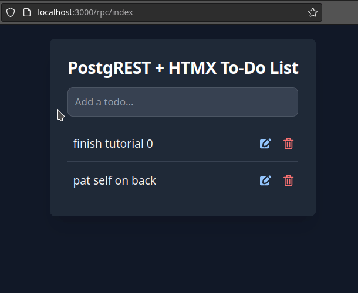
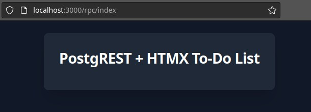
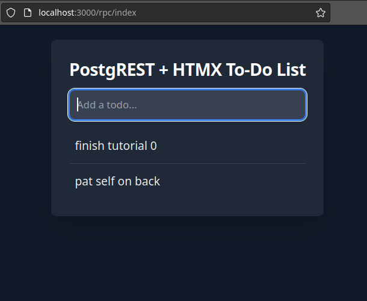
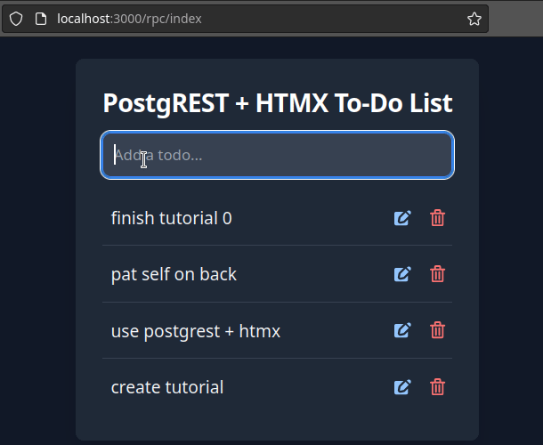

.. _providing_html_htmx:

Providing HTML Content Using Htmx
=================================

:author: `Laurence Isla <https://github.com/laurenceisla>`_

This how-to shows a way to return HTML content and use the `htmx library <https://htmx.org/>`_ to handle the AJAX requests.
Htmx expects an HTML response and uses it to replace an element inside the DOM (see the `htmx introduction <https://htmx.org/docs/#introduction>`_ in the docs).

Preparatory Configuration
-------------------------

We will make a to-do app based on the :ref:`tut0`, so make sure to complete it before continuing.

To simplify things, we won't be using authentication, so grant all permissions on the ``todos`` table to the ``web_anon`` user.

.. code-block:: postgres

  grant all on api.todos to web_anon;
  grant usage, select on sequence api.todos_id_seq to web_anon;

Next, add the ``text/html`` media type as a DOMAIN. With this, PostgREST can identify the request made by your web browser (with the ``Accept: text/html`` header)
and return a raw HTML document file.

.. code-block:: postgres

  create domain "text/html" as text;

Creating an HTML Response
-------------------------

Let's create a function that returns a basic HTML file, using `Tailwind CSS <https://v2.tailwindcss.com/>`_ for styling.

.. code-block:: postgres

  create or replace function api.index() returns "text/html" as $$
    select $html$
      <!DOCTYPE html>
      <html>
      <head>
        <meta charset="utf-8">
        <meta name="viewport" content="width=device-width, initial-scale=1">
        <title>PostgREST + HTMX To-Do List</title>
        <!-- Tailwind for CSS styling -->
        <link href="https://unpkg.com/tailwindcss@2.2.19/dist/tailwind.min.css" rel="stylesheet">
      </head>
      <body class="bg-gray-900">
        

          

            <h5 class="mb-3 text-2xl font-bold tracking-tight text-white">PostgREST + HTMX To-Do List</h5>
          

        

      </body>
      </html>
    $html$;
  $$ language sql;

The web browser will open the web page at ``http://localhost:3000/rpc/index``.

.. _html_htmx_list_create:

Listing and Creating To-Dos
---------------------------

Now, let's show a list of the to-dos already inserted in the database.

.. code-block:: postgres

  create or replace function api.html_todo(api.todos) returns text as $$
    select format($html$
      <li class="py-3">
        
          %3$s
        
      </li>
      $html$,
      $1.id,
      case when $1.done then 'line-through text-gray-400' else '' end,
      $1.task
    );
  $$ language sql stable;

  create or replace function api.html_all_todos() returns text as $$
    select coalesce(
      '<ul id="todo-list" role="list" class="divide-y divide-gray-700 text-gray-100">'
        || string_agg(api.html_todo(t), '' order by t.id) ||
      '</ul>',
      '
There is nothing else to do.
'
    )
    from api.todos t;
  $$ language sql;

These two functions are used to build the to-do list template. We won't use them as PostgREST endpoints.

- The ``api.html_todo`` function uses the table ``api.todos`` as a parameter and formats each item into a list element ``<li>``.
  The PostgreSQL `format <https://www.postgresql.org/docs/current/functions-string.html#FUNCTIONS-STRING-FORMAT>`_ is useful to that end.
  It replaces the values according to the position in the template, e.g. ``%1$s`` will be replaced with the value of ``$1.id`` (the first parameter).

- The ``api.html_all_todos`` function returns the ``<ul>`` wrapper for all the list elements.
  It uses `string_arg <https://www.postgresql.org/docs/current/functions-aggregate.html>`_ to concatenate all the to-dos in a single text value.
  It also returns an alternative message, instead of a list, when the ``api.todos`` table is empty.

Next, let's add an endpoint to register a to-do in the database and modify the ``/rpc/index`` page accordingly.

.. code-block:: postgres

  create or replace function api.add_todo(_task text) returns "text/html" as $$
    insert into api.todos(task) values (_task);
    select api.html_all_todos();
  $$ language sql;

  create or replace function api.index() returns "text/html" as $$
  select $html$
    <!DOCTYPE html>
    <html>
    <head>
      <meta charset="utf-8">
      <meta name="viewport" content="width=device-width, initial-scale=1">
      <title>PostgREST + HTMX To-Do List</title>
      <!-- Tailwind for CSS styling -->
      <link href="https://unpkg.com/tailwindcss@2.2.19/dist/tailwind.min.css" rel="stylesheet">
      <!-- htmx for AJAX requests -->
      
    </head>
    <body class="bg-gray-900"
          hx-headers='{"Accept": "text/html"}'>
      

        

          <h5 class="mb-3 text-2xl font-bold tracking-tight text-white">PostgREST + HTMX To-Do List</h5>
          <form hx-post="/rpc/add_todo"
                hx-target="#todo-list-area"
                hx-trigger="submit"
                hx-on="htmx:afterRequest: this.reset()">
            <input class="bg-gray-50 border text-sm rounded-lg block w-full p-2.5 mb-3 bg-gray-700 border-gray-600 placeholder-gray-400 text-white focus:ring-blue-500 focus:border-blue-500"
                   type="text" name="_task" placeholder="Add a todo...">
          </form>
          

            $html$
              || api.html_all_todos() ||
            $html$
          

        

      

    </body>
    </html>
    $html$;
  $$ language sql;

- The ``/rpc/add_todo`` endpoint allows us to add a new to-do using the ``_task`` parameter and returns an ``html`` with all the to-dos in the database.

- The ``/rpc/index`` now adds the ``hx-headers='{"Accept": "text/html"}'`` tag to the ``<body>``.
  This will make sure that all htmx elements inside the body send this header, otherwise PostgREST won't recognize it as HTML.

  There is also a ``<form>`` element that uses the htmx library. Let's break it down:

  + ``hx-post="/rpc/add_todo"``: sends an AJAX POST request to the ``/rpc/add_todo`` endpoint, with the value of the ``_task`` from the ``<input>`` element.

  + ``hx-target="#todo-list-area"``: the HTML content returned from the request will go inside ``

`` (which is the list of to-dos).

  + ``hx-trigger="submit"``: htmx will do this request when submitting the form (by pressing enter while inside the ``<input>``).

  + ``hx-on="htmx:afterRequest: this.reset()">``: this is a Javascript command that clears the form `after the request is done <https://htmx.org/events/#htmx:afterRequest>`_.

With this, the ``http://localhost:3000/rpc/index`` page lists all the todos and adds new ones by submitting tasks in the input element.
Don't forget to refresh the :ref:`schema cache <schema_reloading>`.

Editing and Deleting To-Dos
---------------------------

Now, let's modify ``api.html_todo`` and make it more functional.

.. code-block:: postgres

  create or replace function api.html_todo(api.todos) returns text as $$
  select format($html$
  <li class="py-3">
    

      

        <form id="edit-task-state-%1$s"
              hx-post="/rpc/change_todo_state"
              hx-vals='{"_id": %1$s, "_done": %4$s}'
              hx-target="#todo-list-area"
              hx-trigger="click">
          
            %3$s
          
        </form>
      

      

        <button class="p-1.5 rounded-full hover:bg-gray-700 focus:ring-gray-800"
                hx-get="/rpc/html_editable_task"
                hx-vals='{"_id": "%1$s"}'
                hx-target="#todo-edit-area-%1$s"
                hx-trigger="click">
          <svg class="w-4 h-4 text-blue-300" aria-hidden="true" xmlns="http://www.w3.org/2000/svg" fill="currentColor" viewBox="0 0 20 18">
            <path d="M12.687 14.408a3.01 3.01 0 0 1-1.533.821l-3.566.713a3 3 0 0 1-3.53-3.53l.713-3.566a3.01 3.01 0 0 1 .821-1.533L10.905 2H2.167A2.169 2.169 0 0 0 0 4.167v11.666A2.169 2.169 0 0 0 2.167 18h11.666A2.169 2.169 0 0 0 16 15.833V11.1l-3.313 3.308Zm5.53-9.065.546-.546a2.518 2.518 0 0 0 0-3.56 2.576 2.576 0 0 0-3.559 0l-.547.547 3.56 3.56Z"/>
            <path d="M13.243 3.2 7.359 9.081a.5.5 0 0 0-.136.256L6.51 12.9a.5.5 0 0 0 .59.59l3.566-.713a.5.5 0 0 0 .255-.136L16.8 6.757 13.243 3.2Z"/>
          </svg>
        </button>
        <button class="p-1.5 rounded-full hover:bg-gray-700 focus:ring-gray-800"
                hx-post="/rpc/delete_todo"
                hx-vals='{"_id": %1$s}'
                hx-target="#todo-list-area"
                hx-trigger="click">
          <svg class="w-4 h-4 text-red-400" aria-hidden="true" xmlns="http://www.w3.org/2000/svg" fill="none" viewBox="0 0 18 20">
            <path stroke="currentColor" stroke-linecap="round" stroke-linejoin="round" stroke-width="2" d="M1 5h16M7 8v8m4-8v8M7 1h4a1 1 0 0 1 1 1v3H6V2a1 1 0 0 1 1-1ZM3 5h12v13a1 1 0 0 1-1 1H4a1 1 0 0 1-1-1V5Z"/>
          </svg>
        </button>
      

    

  </li>
  $html$,
    $1.id,
    case when $1.done then 'line-through text-gray-400' else '' end,
    $1.task,
    (not $1.done)::text
  );
  $$ language sql stable;

Let's deconstruct the new htmx features added:

- The ``<form>`` element is configured as follows:

  + ``hx-post="/rpc/change_todo_state"``: does an AJAX POST request to that endpoint. It will toggle the ``done`` state of the to-do.

  + ``hx-vals='{"_id": %1$s, "_done": %4$s}'``: adds the parameters to the request.
    This is an alternative to using hidden inputs inside the ``<form>``.

  + ``hx-trigger="click"``: htmx does the request after clicking on the element.

- For the first ``<button>``:

  + ``hx-get="/rpc/html_editable_task"``: it does an AJAX GET request to that endpoint.
    It returns an HTML with an input that will allow us to edit the task.

  + ``hx-target="#todo-edit-area"``: the returned HTML will replace the element with this id.
    In this case, this replaces an individual task, not the whole list.

  + ``hx-vals='{"id": "eq.%1$s"}'``: adds the query parameters to the GET request.
    Note that this needs the ``eq.`` operator because it represents a table column not a function parameter.

- For the second ``<button>``:

  + ``hx-post="/rpc/delete_todo"``: this post request will delete the corresponding to-do.

Clicking on the first button will enable the task editing.
That's why we create the ``api.html_editable_task`` function as an endpoint:

.. code-block:: postgres

  create or replace function api.html_editable_task(_id int) returns "text/html" as $$
  select format ($html$
  <form id="edit-task-%1$s"
        hx-post="/rpc/change_todo_task"
        hx-headers='{"Accept": "text/html"}'
        hx-vals='{"_id": %1$s}'
        hx-target="#todo-list-area"
        hx-trigger="submit,focusout">
    <input class="bg-gray-50 border text-sm rounded-lg block w-full p-2.5 bg-gray-700 border-gray-600 text-white focus:ring-blue-500 focus:border-blue-500"
           id="task-%1$s" type="text" name="_task" value="%2$s" autofocus>
  </form>
  $html$,
    id,
    task
  )
  from api.todos
  where id = _id;
  $$ language sql;

In this example, this will return an input field that allows us to edit the corresponding to-do task.

Finally, let's add the endpoints that will modify and delete the to-dos in the database.

.. code-block:: postgres

  create or replace function api.change_todo_state(_id int, _done boolean) returns "text/html" as $$
    update api.todos set done = _done where id = _id;
    select api.html_all_todos();
  $$ language sql;

  create or replace function api.change_todo_task(_id int, _task text) returns "text/html" as $$
    update api.todos set task = _task where id = _id;
    select api.html_all_todos();
  $$ language sql;

  create or replace function api.delete_todo(_id int) returns "text/html" as $$
    delete from api.todos where id = _id;
    select api.html_all_todos();
  $$ language sql;

All of those functions return an HTML list of to-dos that will replace the outdated one:

- The ``api.change_todo_state`` function updates the ``done`` column using the ``_id`` and the ``_done`` values from the request.

- The ``api.delete_todo`` function deletes a to-do using the ``_id`` value from the request.

- The ``api.change_todo_task`` function modifies the ``task`` column  using the ``_id`` and the ``_task`` value from the request.

After refreshing the :ref:`schema cache <schema_reloading>`, the page at ``http://localhost:3000/rpc/index`` will allow us to edit, delete and complete any to-do.

With that, we completed the to-do list functionality.
