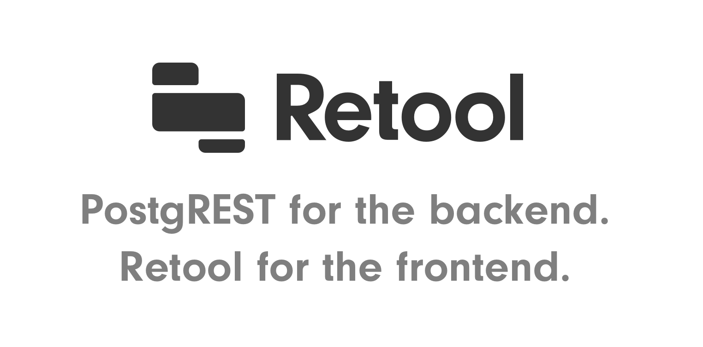

.. |br| raw:: html

    

v7.0.1
======

You can see the full changelog at `PostgREST v7.0.1 release page <https://github.com/PostgREST/postgrest/releases/tag/v7.0.1>`_.

Fixed
-----

* Fix overloaded computed columns on RPC
  |br| -- `@wolfgangwalther <https://github.com/wolfgangwalther>`_

* Fix POST, PATCH, DELETE with ``?select=`` and ``Prefer: return=minimal`` and PATCH with empty body
  |br| -- `@wolfgangwalther <https://github.com/wolfgangwalther>`_

* Fix missing ``openapi-server-proxy-uri`` config option
  |br| -- `@steve-chavez <https://github.com/steve-chavez>`_

* Fix ``Content-Profile`` not working for POST RPC
  |br| -- `@steve-chavez <https://github.com/steve-chavez>`_

* Fix PUT restriction for including all columns in payload
  |br| -- `@steve-chavez <https://github.com/steve-chavez>`_

* Documentation improvements

  + Added package managers to :ref:`install`.

Changed
-------

* From this version onwards, the release page will include a single Linux static executable that can be run on any Linux distribution.

Thanks
------

This release was made possible thanks to:

* `Daniel Babiak <https://github.com/dbabiak>`_
* Evans Fernandes
* `Jan Sommer <https://github.com/nerfpops>`_
* Tsingson Qin
* Michel Pelletier
* Jay Hannah
* Robert Stolarz
* Kofi Gumbs
* Nicholas DiBiase
* Christopher Reid
* Nathan Bouscal
* Daniel Rafaj
* David Fenko

If you'd like to join them, consider `supporting PostgREST development <https://github.com/PostgREST/postgrest#user-content-supporting-development>`_.
