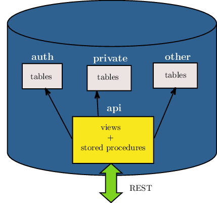

.. note::

  This page is a work in progress.

.. _schema_isolation:

Schema Isolation
================

A PostgREST instance exposes all the tables, views, and stored procedures of a single `PostgreSQL schema <https://www.postgresql.org/docs/current/ddl-schemas.html>`_ (a namespace of database objects). This means private data or implementation details can go inside different private schemas and be invisible to HTTP clients.

It is recommended that you don't expose tables on your API schema. Instead expose views and stored procedures which insulate the internal details from the outside world.
This allows you to change the internals of your schema and maintain backwards compatibility. It also keeps your code easier to refactor, and provides a natural way to do API versioning.

.. _func_privs:

Functions
=========

By default, when a function is created, the privilege to execute it is not restricted by role. The function access is ``PUBLIC`` — executable by all roles (more details at `PostgreSQL Privileges page <https://www.postgresql.org/docs/current/ddl-priv.html>`_). This is not ideal for an API schema. To disable this behavior, you can run the following SQL statement:

.. code-block:: postgres

  ALTER DEFAULT PRIVILEGES REVOKE EXECUTE ON FUNCTIONS FROM PUBLIC;

This will change the privileges for all functions created in the future in all schemas. Currently there is no way to limit it to a single schema. In our opinion it's a good practice anyway.

.. note::

    It is however possible to limit the effect of this clause only to functions you define. You can put the above statement at the beginning of the API schema definition, and then at the end reverse it with:

    .. code-block:: postgres

        ALTER DEFAULT PRIVILEGES GRANT EXECUTE ON FUNCTIONS TO PUBLIC;

    This will work because the :code:`alter default privileges` statement has effect on function created *after* it is executed. See `PostgreSQL alter default privileges <https://www.postgresql.org/docs/current/sql-alterdefaultprivileges.html>`_ for more details.

After that, you'll need to grant EXECUTE privileges on functions explicitly:

.. code-block:: postgres

   GRANT EXECUTE ON FUNCTION login TO anonymous;
   GRANT EXECUTE ON FUNCTION signup TO anonymous;

You can also grant execute on all functions in a schema to a higher privileged role:

.. code-block:: postgres

    GRANT EXECUTE ON ALL FUNCTIONS IN SCHEMA api TO web_user;

Security definer
----------------

A function is executed with the privileges of the user who calls it. This means that the user has to have all permissions to do the operations the procedure performs.
If the function accesses private database objects, your :ref:`API roles <roles>` won't be able to successfully execute the function.

Another option is to define the function with the :code:`SECURITY DEFINER` option. Then only one permission check will take place, the permission to call the function, and the operations in the function will have the authority of the user who owns the function itself.

.. code-block:: postgres

  -- login as a user wich has privileges on the private schemas

  -- create a sample function
  create or replace function login(email text, pass text) returns jwt_token as $$
  begin
    -- access to a private schema called 'auth'
    select auth.user_role(email, pass) into _role;
    -- other operations
    -- ...
  end;
  $$ language plpgsql security definer;

Note the ``SECURITY DEFINER`` keywords at the end of the function. See `PostgreSQL documentation <https://www.postgresql.org/docs/current/sql-createfunction.html#SQL-CREATEFUNCTION-SECURITY>`_ for more details.

Views
=====

Views are invoked with the privileges of the view owner, much like stored procedures with the ``SECURITY DEFINER`` option. When created by a SUPERUSER role, all `row-level security <https://www.postgresql.org/docs/current/ddl-rowsecurity.html>`_ will be bypassed unless a different, non-SUPERUSER owner is specified.

For changing this, we can create a non-SUPERUSER role and make this role the view's owner.

.. code-block:: postgres

  CREATE ROLE api_views_owner NOINHERIT;
  ALTER VIEW sample_view OWNER TO api_views_owner;

Rules
-----

Insertion on views with complex `rules <https://www.postgresql.org/docs/current/sql-createrule.html>`_ might not work out of the box with PostgREST.
It's recommended that you `use triggers instead of rules <https://wiki.postgresql.org/wiki/Don%27t_Do_This#Don.27t_use_rules>`_.
If you want to keep using rules, a workaround is to wrap the view insertion in a stored procedure and call it through the :ref:`s_procs` interface.
For more details, see this `github issue <https://github.com/PostgREST/postgrest/issues/1283>`_.
